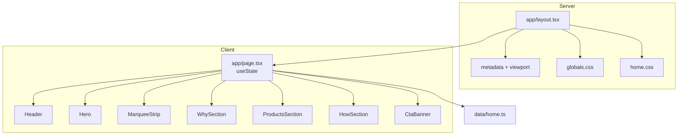

# Cấu trúc dự án Gọt Gòi Nè

Cập nhật: 2026-05-31

Tài liệu tổng hợp cấu trúc codebase: thư mục, vai trò từng file, luồng dữ liệu, style, state và roadmap. Dùng để onboard nhanh hoặc copy ngữ cảnh cho AI.

Xem thêm:

- `docs/technical-spec.md` — thông số kỹ thuật và quy trình kiểm chứng
- `docs/refactor-notes.md` — nhật ký refactor từng bước
- `AGENTS.md` — quy tắc làm việc trong dự án

---

## 1. Tổng quan

**Gọt Gòi Nè** là landing page Next.js cho thương hiệu trái cây gọt sẵn tại Cần Thơ.

Giai đoạn hiện tại: **MVP một trang**, ưu tiên:

- Ổn định nền dự án
- Dễ học lại và dễ giải thích
- Chuẩn bị cho cart, đặt hàng, quản lý sản phẩm, đa ngôn ngữ, backend
- Không tạo abstraction phức tạp khi chưa có nhu cầu thật

---

## 2. Cây thư mục

```text
gotgoine/
├── app/                          # Next.js App Router
│   ├── layout.tsx                # Server — khung HTML, SEO, import CSS
│   ├── page.tsx                  # Client — composition root, state
│   ├── globals.css               # Tailwind + nền global
│   └── home.css                  # CSS landing (~722 dòng, global class)
│
├── components/
│   └── home/                     # UI từng section trang chủ
│       ├── header.tsx
│       ├── hero.tsx
│       ├── marquee-strip.tsx
│       ├── why-section.tsx
│       ├── products-section.tsx
│       ├── how-section.tsx
│       └── cta-banner.tsx
│
├── data/
│   └── home.ts                   # Dữ liệu tĩnh + TypeScript types
│
├── docs/
│   ├── project-structure.md      # Tài liệu này
│   ├── technical-spec.md
│   └── refactor-notes.md
│
├── public/
│   ├── images/
│   │   └── logo-main.jpg         # Logo thương hiệu
│   ├── file.svg                  # Asset mặc định Next (chưa dùng)
│   ├── vercel.svg
│   └── window.svg
│
├── .vscode/
│   └── settings.json             # Ẩn .next, node_modules trong editor
│
├── AGENTS.md                     # Quy tắc làm việc + refactor
├── CLAUDE.md                     # Trỏ tới AGENTS.md
├── README.md                     # Hướng dẫn chạy dự án
├── package.json
├── package-lock.json
├── tsconfig.json
├── next.config.ts
├── eslint.config.mjs
├── postcss.config.mjs
└── .gitignore
```

**Thư mục tự sinh (không sửa tay):** `.next/`, `node_modules/`

**Chưa có (dự kiến sau):** `store/` (Zustand cart), `lib/`, `app/api/`, route phụ (`/cart`, `/order`, …)

---

## 3. Stack kỹ thuật

| Lớp | Công nghệ | Phiên bản / ghi chú |
| --- | --- | --- |
| Framework | Next.js (App Router) | 16.2.4 — có breaking changes so với Next cũ |
| UI | React | 19.2.4 |
| Ngôn ngữ | TypeScript | 5, `strict: true` |
| Style | Tailwind CSS v4 + CSS thuần | PostCSS plugin `@tailwindcss/postcss` |
| State (đã cài, chưa dùng) | Zustand | 5.x |
| Icon (đã cài, chưa dùng) | lucide-react | 1.x |
| Lint | ESLint 9 + eslint-config-next | core-web-vitals + typescript |

**Alias import:** `@/*` → thư mục gốc dự án (`tsconfig.json`)

---

## 4. Kiến trúc runtime



### Phân tầng trách nhiệm

| Tầng | Vai trò | File chính |
| --- | --- | --- |
| Layout | Khung HTML, SEO, import CSS | `app/layout.tsx` |
| Page | Ghép section, quản lý state, truyền props | `app/page.tsx` |
| Components | Render UI từng section | `components/home/*` |
| Data | Nội dung tĩnh + types | `data/home.ts` |
| Style | Giao diện | `globals.css` + `home.css` |
| Assets | Hình ảnh tĩnh | `public/images/` |

**Luồng dữ liệu:** `data/home.ts` → `app/page.tsx` → `components/home/*` (một chiều, qua props)

---

## 5. Chi tiết từng file

### 5.1 `app/layout.tsx` — Server Component

| Nhiệm vụ | Chi tiết |
| --- | --- |
| SEO | `title`, `description`, Open Graph (`locale: vi_VN`) |
| Viewport | `themeColor: #f8fdf7` |
| HTML | `lang="vi"`, nền `#f8fdf7`, `antialiased` |
| CSS | Import `globals.css` trước, `home.css` sau |
| Children | Render `{children}` — hiện chỉ có trang `/` |

Không có `"use client"` → không dùng hooks.

### 5.2 `app/page.tsx` — Client Component (~45 dòng)

| Nhiệm vụ | Chi tiết |
| --- | --- |
| Directive | `"use client"` — vì dùng `useState` |
| State | `activeCategory` (mặc định `"🔥 Hộp cắt sẵn"`) |
| State | `flash` (`string \| null`) — hiệu ứng nút `＋` → `✓` trong 900ms |
| Handler | `handleAdd(key)` — set flash, tự reset sau timeout |
| Render | Ghép 7 component theo thứ tự dọc trang |

**Thứ tự section:**

```text
Header → Hero → MarqueeStrip → WhySection → ProductsSection → HowSection → CtaBanner
```

### 5.3 `data/home.ts` — Dữ liệu & types (~155 dòng)

#### Types

| Type | Trường |
| --- | --- |
| `HeroStat` | `value`, `label` |
| `WhyReason` | `icon`, `title`, `description` |
| `Product` | `id`, `emoji`, `name`, `weight`, `price`, `badge?`, `featured?`, `description?` |
| `ProcessStep` | `number`, `icon`, `title`, `description` |

#### Dữ liệu export

| Export | Số lượng | Mục đích |
| --- | --- | --- |
| `categories` | 6 | Pill danh mục header |
| `marqueeItems` | 8 | Dải chạy sản phẩm |
| `heroStats` | 3 | Số liệu hero |
| `whyReasons` | 3 | Lý do chọn thương hiệu |
| `products` | 5 | Sản phẩm bán chạy (p1 featured) |
| `processSteps` | 4 | Quy trình 4 bước |

### 5.4 `components/home/*` — UI sections

| File | Props | Tương tác | Dữ liệu từ page |
| --- | --- | --- | --- |
| `header.tsx` | `categories`, `activeCategory`, `onCategoryChange` | Click pill danh mục | `categories` |
| `hero.tsx` | `stats`, `flash`, `onAdd` | Nút `＋` hero | `heroStats` |
| `marquee-strip.tsx` | `items` | Không | `marqueeItems` |
| `why-section.tsx` | `reasons` | Không | `whyReasons` |
| `products-section.tsx` | `products`, `flash`, `onAdd` | Nút `＋` từng sản phẩm | `products` |
| `how-section.tsx` | `steps` | Không | `processSteps` |
| `cta-banner.tsx` | *(không)* | Link `href="#"` | hardcode trong file |

**Ghi chú:**

- Không file nào có `"use client"` riêng — được bundle client vì import từ `page.tsx`.
- `header.tsx` dùng `next/image` cho logo (`/images/logo-main.jpg`, `priority`).
- `hero.tsx` có nội dung hardcode (slogan, thẻ dứa mật) — chưa nằm trong `data/home.ts`.
- `marquee-strip.tsx` nhân đôi mảng `items.concat(items)` để loop animation liền mạch.

### 5.5 CSS — hai lớp style

#### `app/globals.css` (~29 dòng)

| Nội dung | Mục đích |
| --- | --- |
| `@import "tailwindcss"` | Kích hoạt Tailwind v4 |
| `:root` | `--background: #f8fdf7`, `color-scheme: light` |
| `html` | Nền sáng, `overscroll-behavior-y: none` |
| `body` | Font Arial, màu chữ `#171717` |

#### `app/home.css` (~722 dòng) — global CSS landing

**CSS variables (`:root`):**

| Biến | Vai trò |
| --- | --- |
| `--bg` | Nền main `#f0f9e1` |
| `--text`, `--text-muted` | Màu chữ |
| `--green-dark`, `--green-mid` | Xanh thương hiệu |
| `--accent`, `--accent-lt` | Vàng nhấn |
| `--r-sm/md/lg/pill` | Border radius |
| `--shadow-lg`, `--border` | Shadow, viền |

**Nhóm class theo section:**

| Section | Class chính |
| --- | --- |
| Chung | `.container`, `.section-eyebrow`, `.section-title`, `.section-sub` |
| Header | `.nav-top`, `.nav-logo*`, `.nav-search*`, `.nav-actions`, `.nav-lang`, `.nav-cats`, `.cat-pill` |
| Hero | `.hero*`, `.btn-primary`, `.btn-ghost`, `.stat-*`, `.float-tag*`, `.live-dot`, `.hero-add-btn` |
| Marquee | `.marquee-strip`, `.marquee-track`, `.marquee-item`, `@keyframes scrollX` |
| Why | `.why-section`, `.why-grid`, `.why-card`, `.why-icon` |
| Products | `.products-section`, `.products-bento`, `.product-card`, `.p-*`, `.p-add` |
| How | `.how-section`, `.how-inner`, `.steps-grid`, `.step-card`, `.step-*` |
| CTA | `.cta-wrap`, `.cta-banner`, `.btn-dark` |
| Nút thêm | `.hero-add-btn`, `.p-add`, `.is-done` |

**Responsive:**

| Breakpoint | Thay đổi chính |
| --- | --- |
| `≤ 1100px` | Hero 1 cột; grid 2 cột (why, steps, products) |
| `≤ 700px` | Padding 16px; search full width; grid 1 cột |

**Rủi ro:** Global CSS — class trùng tên ở page khác sau này có thể xung đột.

### 5.6 `public/` — static assets

| File | Dùng ở đâu |
| --- | --- |
| `images/logo-main.jpg` | `Header` — `next/image` |
| `*.svg` | Asset mặc định Next, chưa dùng trong landing |

Đường dẫn public: `/images/logo-main.jpg` (không cần prefix `public/`).

### 5.7 Cấu hình build & chất lượng

| File | Vai trò |
| --- | --- |
| `package.json` | Scripts, dependencies |
| `tsconfig.json` | Strict TS, `@/*` alias |
| `next.config.ts` | Cấu hình Next (hiện trống) |
| `eslint.config.mjs` | ESLint Next |
| `postcss.config.mjs` | Plugin Tailwind v4 |

#### Scripts

| Lệnh | Công dụng |
| --- | --- |
| `npm run dev` | `http://localhost:3000` |
| `npm run build` | Production build |
| `npm run start` | Chạy sau build |
| `npm run lint` | ESLint |
| `npm run typecheck` | `tsc --noEmit` |
| `npm run verify` | lint → typecheck → build |

---

## 6. Mapping UI (từ trên xuống trang)

| # | Section | Component | Dữ liệu | State / tương tác | Placeholder |
| --- | --- | --- | --- | --- | --- |
| 1 | Header + nav | `Header` | `categories` | `activeCategory`, click pill | Search, VI/EN, link `#` |
| 2 | Hero | `Hero` | `heroStats` + hardcode | `flash`, `onAdd("hero")` | CTA `href="#"` |
| 3 | Marquee | `MarqueeStrip` | `marqueeItems` | — | — |
| 4 | Why | `WhySection` | `whyReasons` | — | — |
| 5 | Products | `ProductsSection` | `products` | `flash`, `onAdd(id)` | Chưa thêm giỏ thật |
| 6 | How | `HowSection` | `processSteps` | — | — |
| 7 | CTA | `CtaBanner` | hardcode | — | `href="#"` |

---

## 7. State hiện tại

```text
app/page.tsx
├── activeCategory: string     → Header (highlight pill)
└── flash: string | null       → Hero + ProductsSection (nút ＋/✓)
    └── handleAdd(key)         → setTimeout 900ms reset
```

**Chưa có:** cart, global store, API, form, routing thật, i18n logic.

---

## 8. Copy file cho AI — theo tình huống

| Tình huống | File copy (ưu tiên) |
| --- | --- |
| AI mới, hiểu dự án | `project-structure.md` → `technical-spec.md` → `AGENTS.md` → `page.tsx` → `data/home.ts` |
| Sửa UI một section | Component tương ứng → `home.css` (đoạn class) → `page.tsx` |
| Đổi nội dung / giá | `data/home.ts` |
| State / cart | `page.tsx` → `products-section.tsx` → `hero.tsx` → `header.tsx` → `data/home.ts` |
| SEO | `layout.tsx` |
| Lỗi build | `package.json` → `tsconfig.json` → file đang sửa → log lỗi |

**Không nên copy:** `package-lock.json`, ảnh trong `public/`, `.next/`

---

## 9. Trạng thái phát triển

### Đã hoàn thành

- Metadata, viewport, `lang="vi"`, nền sáng cố định
- Tách dữ liệu → `data/home.ts`
- Tách CSS → `app/home.css`
- Tách 7 component → `components/home/`
- Types TypeScript cho dữ liệu
- Dev server cố định `localhost:3000`
- `npm run verify`
- Nhật ký refactor

### Chưa làm (roadmap)

1. Cart Zustand
2. UI giỏ hàng (badge, drawer)
3. Đặt hàng (Zalo / Messenger / form)
4. Routing CTA, search, VI/EN
5. Tách CSS theo component khi có nhiều page
6. Backend / API / database

---

## 10. Rủi ro kỹ thuật

| Rủi ro | Mức | Ghi chú |
| --- | --- | --- |
| `home.css` global | Trung bình | Xung đột khi thêm page |
| Link `href="#"` | Thấp | OK cho MVP |
| `zustand`, `lucide-react` chưa dùng | Thấp | Dự phòng cart/icon |
| Không có test tự động | Trung bình | Dựa vào `verify` |
| Hero product hardcode | Thấp | Không đồng bộ với `products` |

---

## 11. Hướng mở rộng cấu trúc (dự kiến)

```text
gotgoine/
├── store/
│   └── cart.ts              # Zustand
├── components/
│   ├── home/                # (đã có)
│   └── cart/                # drawer, badge
├── lib/                     # helpers, format giá
└── app/
    ├── page.tsx
    └── api/                 # khi có backend
```
