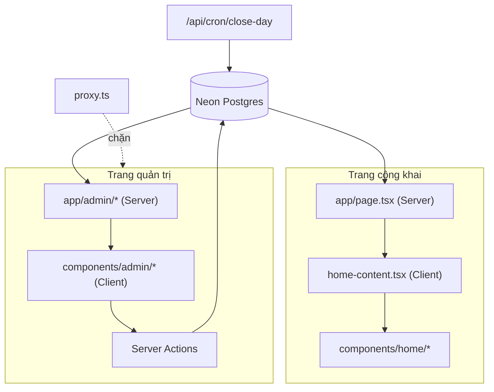

# Cấu trúc dự án Gọt Gòi Nè

Cập nhật: 2026-08-21

Tài liệu tổng hợp: dự án là gì, dữ liệu chảy thế nào, file nào làm gì. Dùng để onboard người mới hoặc nạp ngữ cảnh cho AI.

Xem thêm:

- `AGENTS.md` — tổng quan ngắn + quy tắc làm việc (agent đọc file này mỗi phiên)
- `docs/refactor-notes.md` — nhật ký refactor theo thời gian, **là nguồn chuẩn** cho mọi quyết định đã đưa ra
- `docs/technical-spec.md` — thông số kỹ thuật và quy trình kiểm chứng

---

## 1. Tổng quan

**Gọt Gòi Nè** là website của một tiệm trái cây gọt sẵn ở Phú Lợi, Cần Thơ, gồm hai nửa:

- **Trang công khai** cho khách xem menu hôm nay, song ngữ Việt/Anh.
- **Trang quản trị** (`/admin`, có mật khẩu) để chủ tiệm vận hành hằng ngày: đưa trái cây vào menu, nhập định lượng, ghi nhận đã bán và hàng hư hỏng, xem thống kê, tạo poster đăng bài.

Triển khai trên Vercel tại <https://gotgoine.vercel.app>, tự động deploy khi push lên `main`.

Điều quan trọng nhất cần nắm: **tiệm vận hành theo ngày, không theo danh mục cố định**. Sáng chủ tiệm chọn hôm nay bán gì và nhập bao nhiêu; khách chỉ thấy đúng những loại đó và chỉ khi còn hàng.

---

## 2. Cây thư mục

```text
gotgoine/
├── app/
│   ├── layout.tsx                # Khung HTML, SEO, JSON-LD LocalBusiness
│   ├── page.tsx                  # Trang chủ (Server) — nạp menu hôm nay
│   ├── sitemap.ts, robots.ts     # SEO, Next tự sinh ra XML/txt
│   ├── globals.css, home.css     # Style trang công khai
│   ├── login/, register/         # Đăng nhập, đăng ký (đang khoá đăng ký)
│   ├── admin/
│   │   ├── layout.tsx            # Thanh 5 tab + nút đăng xuất
│   │   ├── page.tsx              # Tổng quan: số liệu nhanh trong ngày
│   │   ├── products/             # Danh sách trái cây + thực đơn hôm nay
│   │   ├── fridge/               # Tủ lạnh: tồn kho, ghi nhận hư hỏng
│   │   ├── stats/                # Thống kê theo tháng
│   │   └── poster/               # Công cụ tạo poster
│   └── api/
│       ├── auth/[...nextauth]/   # Auth.js
│       └── cron/close-day/       # Chốt ngày 00:00 giờ VN
│
├── components/
│   ├── home/                     # Các section trang công khai
│   └── admin/                    # UI quản trị (client components)
│
├── lib/
│   ├── prisma.ts                 # Singleton Prisma Client
│   ├── products.ts               # Menu hôm nay cho trang chủ
│   ├── close-day.ts              # Logic chuyển hàng tồn sang ngày mới
│   ├── date-vn.ts                # MỌI khái niệm "hôm nay" đi qua đây
│   ├── stats.ts                  # Tổng hợp số liệu theo tháng
│   ├── qty.ts, money.ts          # Định dạng gram và tiền
│   ├── language-context.tsx      # Context VI/EN
│   └── i18n/home-strings.tsx     # Chuỗi giao diện song ngữ
│
├── data/
│   ├── home.ts                   # Nội dung tĩnh trang chủ + EN_PRODUCTS
│   ├── fruit-box.ts              # Cấu hình mục "Tự tay ghép hộp"
│   └── poster.ts                 # Từ điển trái cây cho công cụ poster
│
├── prisma/
│   ├── schema.prisma             # 4 model
│   ├── migrations/
│   └── *.mjs                     # Script dữ liệu chạy một lần
│
├── proxy.ts                      # Chặn /admin (Next 16 đổi tên từ middleware)
├── auth.ts, auth.config.ts       # Auth.js v5
└── vercel.json                   # Lịch cron chốt ngày
```

---

## 3. Stack kỹ thuật

| Lớp | Công nghệ | Ghi chú |
| --- | --- | --- |
| Framework | Next.js 16 (App Router, Turbopack) | Có breaking changes so với Next cũ — đọc `node_modules/next/dist/docs/` trước khi viết |
| UI | React 19 + TypeScript 5 | `strict: true` |
| Style | Tailwind v4 + CSS global | Class trang chủ đều có tiền tố `home-`; trang poster dùng CSS Modules |
| CSDL | Neon Postgres + Prisma 6 | **Ghim 6.x, không nâng 7** — v7 đòi driver adapter, ma sát thật với Next 16 mà không lợi gì ở quy mô này |
| Xác thực | Auth.js v5 (Credentials) | Admin cứng qua biến môi trường, user thường lưu CSDL |
| Icon | lucide-react | |

**Alias import:** `@/*` → thư mục gốc dự án.

---

## 4. Mô hình dữ liệu

```prisma
Product          // Danh mục trái cây: mọi loại tiệm từng bán
DailyMenuEntry   // Một loại, bán trong MỘT ngày cụ thể
InventoryLoss    // Nhật ký hao hụt, bắt buộc có lý do
User             // Tài khoản (chưa có khu vực dành riêng cho user)
```

`DailyMenuEntry` là trung tâm của cả hệ thống:

| Trường | Ý nghĩa |
| --- | --- |
| `date` | Ngày áp dụng, theo lịch Việt Nam, lưu ở mốc 00:00 UTC |
| `priceToday` | Giá bán riêng của ngày đó, số nguyên đồng |
| `qtyGrams` | Lượng bày bán hôm đó |
| `soldGrams` | Đã bán, chủ tiệm cập nhật tay |
| `spoiledGrams` | Hư hỏng, chỉ tăng qua form ở tab Tủ lạnh |

Khoá duy nhất `[productId, date]` — mỗi loại chỉ một dòng mỗi ngày. Dòng của ngày cũ **giữ nguyên làm lịch sử**, không bao giờ ghi đè, nhờ vậy tab Thống kê có số thật để tính.

**Công thức nghiệp vụ duy nhất cần nhớ:**

```
còn lại = qtyGrams − soldGrams − spoiledGrams
```

### Chốt ngày

00:00 giờ Việt Nam, Vercel Cron gọi `/api/cron/close-day` (`vercel.json` đặt `0 17 * * *` vì máy chủ chạy UTC):

- còn lại > 0 → loại đó vào menu hôm nay với đúng phần còn lại, `soldGrams`/`spoiledGrams` về 0;
- còn lại ≤ 0 → rời menu, muốn bán tiếp phải chủ động thêm lại.

Chốt ngày **không xoá gì cả**. Chạy lại nhiều lần không nhân đôi nhờ khoá duy nhất. Nếu cron lỡ không chạy, trang quản trị hiện dải cảnh báo vàng kèm nút bấm tay (`getPendingCarryDate`).

---

## 5. Kiến trúc runtime


```mermaid
flowchart TB
  db[("Neon Postgres")]

  subgraph public ["Trang công khai"]
    page["app/page.tsx (Server)"]
    homeclient["home-content.tsx (Client)"]
    sections["components/home/*"]
  end

  subgraph admin ["Trang quản trị"]
    adminpages["app/admin/* (Server)"]
    adminui["components/admin/* (Client)"]
    actions["Server Actions"]
  end

  cron["/api/cron/close-day"]
  proxy["proxy.ts"]

  db --> page
  page --> homeclient
  homeclient --> sections
  db --> adminpages
  adminpages --> adminui
  adminui --> actions
  actions --> db
  cron --> db
  proxy -.chặn.-> admin
```

Khuôn mẫu dùng xuyên suốt: **Server Component nạp dữ liệu qua Prisma → Client Component nhỏ lo tương tác → Server Action ghi ngược lại**. Mỗi action gọi `revalidatePath` cho cả trang quản trị lẫn trang chủ, nên chủ tiệm sửa xong là khách thấy ngay, không cần deploy lại.

Các trang đọc dữ liệu sống đều phải khai `export const dynamic = "force-dynamic"` — thiếu là Next dựng sẵn thành tĩnh và mọi thay đổi không bao giờ lên trang live.

---

## 6. Trang công khai

`app/page.tsx` gọi `getTodayMenu()` trong `lib/products.ts`: lấy `DailyMenuEntry` của hôm nay, **bỏ những loại còn lại ≤ 0**, đổi `priceToday` thành chuỗi hiển thị.

`components/home/home-content.tsx` bọc `LanguageProvider` và giữ toàn bộ state tương tác (danh mục đang chọn, hiệu ứng thêm giỏ).

Có **hai** chỗ liệt kê trái cây, cả hai đọc cùng một nguồn — thêm chỗ thứ ba thì phải nối vào đúng nguồn này:

1. `products-section.tsx` — lưới sản phẩm, lọc theo danh mục đang chọn;
2. `fruit-box-section.tsx` — mục "Tự tay ghép hộp", dựng danh sách qua `fruitBoxItemsFromProducts()`.

**Đa ngôn ngữ:** bản tiếng Việt lấy từ CSDL, bản tiếng Anh vẫn dùng `EN_PRODUCTS` tĩnh trong `data/home.ts` — chủ tiệm chọn chỉ quản lý nội dung tiếng Việt. Hệ quả: khách xem bản tiếng Anh thấy danh sách không theo tồn kho thật.

---

## 7. Trang quản trị

| Tab | Đường dẫn | Nội dung |
| --- | --- | --- |
| Tổng quan | `/admin` | Đang bán, đã bán hết, hao hụt, đã bán hôm nay + lối tắt |
| Sản phẩm | `/admin/products` | Hai cột: danh sách trái cây (tìm kiếm, thêm mới) và thực đơn hôm nay (giá, nhập, đã bán, còn lại, đổi thứ tự) |
| Tủ lạnh | `/admin/fridge` | Ba thẻ chỉ số, tồn kho hôm nay + form ghi nhận hư hỏng, nhật ký 7 ngày |
| Thống kê | `/admin/stats` | Theo tháng: lượng bán, hao hụt, tỷ lệ, biểu đồ tuần, bán chạy, hao hụt theo lý do |
| Poster | `/admin/poster` | Công cụ tạo poster, xuất PNG bằng html2canvas |

Ô nhập số trong thực đơn lưu khi **rời ô** chứ không lưu theo từng ký tự — gõ "1000" mà bắn 4 lượt ghi là lãng phí. Sau khi lưu, dòng được dựng lại nhờ `key` gộp cả số liệu máy chủ, thay vì đồng bộ state bằng `useEffect`.

`reportSpoilage` gói việc trừ kho và ghi nhật ký vào một `$transaction` — tách rời thì một lần lỗi giữa chừng sẽ để lại kho bị trừ mà không có dòng nào giải thích.

---

## 8. Xác thực

- `proxy.ts` (Next 16 đổi tên từ `middleware.ts`) chặn `/admin/:path*`. Hàm export **phải là định danh thuần**, không được destructure — nếu không Next không nhận ra và build lỗi với thông báo gây hiểu nhầm.
- `auth.config.ts` giữ config dùng chung cho proxy; **mọi callback thêm claim tuỳ biến như `role` phải nằm ở đây**, không chỉ trong `auth.ts`, nếu không proxy không bao giờ thấy `role` và user bị đá về `/login` ngay sau khi đăng nhập thành công.
- Mật khẩu admin lưu dạng bcrypt **đã mã hoá base64** (`ADMIN_PASSWORD_HASH_B64`) vì trình đọc file env của Next nuốt mất các đoạn bắt đầu bằng `$`.
- Đăng nhập trực tiếp (không qua `callbackUrl`) đưa thẳng vào `/admin`.
- Đăng ký user thường đang **khoá** bằng cờ `REGISTRATION_ENABLED` trong `app/register/actions.ts`.

---

## 9. Biến môi trường

Xem `.env.local.example` để biết danh sách đầy đủ. Đáng lưu ý:

| Biến | Ghi chú |
| --- | --- |
| `DATABASE_URL`, `DATABASE_URL_UNPOOLED` | Do tích hợp Neon của Vercel sinh ra — luôn `vercel env ls` xem tên thật, đừng đoán |
| `ADMIN_USERNAME`, `ADMIN_PASSWORD_HASH_B64` | Tài khoản quản trị |
| `CRON_SECRET` | Bí mật để Vercel Cron gọi endpoint chốt ngày; thiếu thì endpoint trả HTTP 500 |
| `NEXT_PUBLIC_*_PIXEL_ID`, `..._GA_...` | Analytics, chưa render gì cho tới khi điền ID thật |

**Prisma CLI không đọc `.env.local`.** Chạy:

```bash
set -a && source .env.local && set +a && npx prisma studio
```

**Cả production, preview và local dev dùng chung một CSDL Neon** — ghi ở máy local là ghi thẳng vào dữ liệu của trang đang chạy thật. Cẩn thận khi thử nghiệm.

---

## 10. Quy trình một ngày của chủ tiệm

1. Sáng mở `/admin` — hàng tồn hôm qua đã tự nằm sẵn trong thực đơn hôm nay.
2. Tab **Sản phẩm**: thêm loại mới muốn bán, chỉnh định lượng nhập và giá.
3. Trong ngày: cập nhật ô "Đã bán"; hàng hỏng thì sang tab **Tủ lạnh** ghi nhận kèm lý do.
4. Bán hết loại nào, loại đó tự biến mất khỏi trang khách.
5. 00:00 hệ thống tự chốt ngày.
6. Cuối tháng xem tab **Thống kê**.

---

## 11. Trạng thái và hướng phát triển

**Đã có:** trang chủ theo menu ngày, quản trị 5 tab, chốt ngày tự động, nhật ký hao hụt, thống kê tháng, SEO cơ bản, tạo poster, đăng nhập.

**Chưa có / còn bỏ ngỏ:**

- Giỏ hàng và đặt hàng thật — nút "Đặt hộp này" mới chỉ hiện thông báo "sắp ra mắt"; `pricePerPart` và `fee` trong `data/fruit-box.ts` khai rồi nhưng chưa dùng.
- **Doanh thu.** Lượng bán tính bằng gram còn giá là giá một phần bán cho khách, nhân hai thứ đó ra số sai. Muốn có doanh thu phải chốt giá theo kg trước, khi đó giá hiển thị cho khách cũng thành giá/kg.
- Ảnh sản phẩm thật — cột `Product.imageUrl` đã có sẵn nhưng chưa bật upload, giao diện vẫn dùng emoji.
- Bản tiếng Anh đọc từ CSDL.
- Khu vực dành riêng cho user thường (hiện đăng ký xong chỉ về trang chủ).
