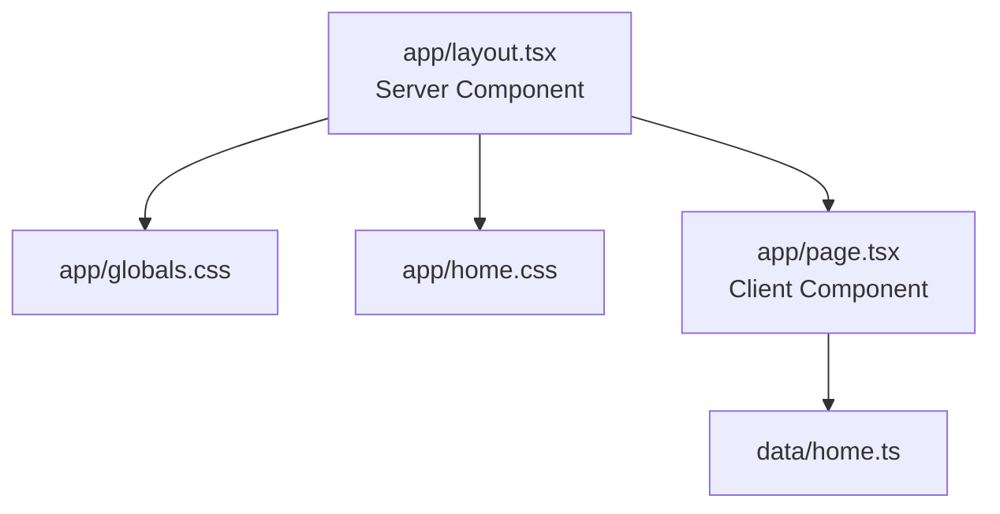

# Technical Specification

Cập nhật: 2026-05-31

Tài liệu này mô tả trạng thái kỹ thuật hiện tại của dự án Gọt Gòi Nè. Mục tiêu là giúp đọc code nhanh hơn, hiểu ranh giới kỹ thuật rõ hơn, và quản trị rủi ro trước khi refactor tiếp.

## 1. Mục tiêu kỹ thuật

Gọt Gòi Nè hiện là landing page Next.js cho thương hiệu trái cây gọt sẵn tại Cần Thơ.

Giai đoạn hiện tại là MVP một trang, ưu tiên:

- Ổn định nền dự án.
- Dễ học lại và dễ giải thích cho người mới quay lại lập trình.
- Chuẩn bị đường phát triển cho cart, đặt hàng, quản lý sản phẩm, đa ngôn ngữ và backend.
- Không tạo abstraction phức tạp khi chưa có nhu cầu thật.

## 2. Stack

| Lớp | Công nghệ | Ghi chú |
| --- | --- | --- |
| Framework | Next.js 16.2.4 | App Router. Có breaking changes; đọc `node_modules/next/dist/docs/` trước khi sửa code Next.js. |
| UI | React 19.2.4 | Trang chủ đang là Client Component vì dùng `useState`. |
| Ngôn ngữ | TypeScript 5 | `strict: true`, alias `@/*` trỏ về thư mục gốc. |
| Style | Tailwind CSS v4 + CSS thuần | `app/globals.css` và `app/home.css`. |
| Icon | lucide-react | Đã cài, chưa dùng trong code. |
| State | Zustand | Đã cài, chưa dùng; hiện dùng local state bằng `useState`. |
| Lint | ESLint 9 + eslint-config-next | Chạy qua `npm run lint`. |

## 3. Scripts

| Script | Công dụng |
| --- | --- |
| `npm run dev` | Chạy dev server tại `http://localhost:3000`. |
| `npm run build` | Tạo production build. |
| `npm run start` | Chạy production server sau khi build. |
| `npm run lint` | Kiểm tra quy tắc code. |
| `npm run typecheck` | Kiểm tra TypeScript bằng `tsc --noEmit`. |
| `npm run verify` | Chạy `lint`, `typecheck`, rồi `build`. |

Dev server được cố định bằng:

```bash
next dev --port 3000 --hostname localhost
```

Mục tiêu là tránh việc Next.js tự chuyển sang `3001`, gây nhầm khi mở localhost.

## 4. Cấu trúc thư mục chính

```text
app/
  layout.tsx      metadata, viewport, HTML/body, import CSS
  page.tsx        composition root, state và ghép section
  globals.css     Tailwind import, nền global, overscroll
  home.css        style landing page, hiện khoảng 721 dòng
components/home/
  header.tsx      logo, search, danh mục
  hero.tsx        hero + thẻ sản phẩm nổi bật
  marquee-strip.tsx
  why-section.tsx
  products-section.tsx
  how-section.tsx
  cta-banner.tsx
data/
  home.ts         dữ liệu tĩnh và types
docs/
  project-structure.md
  refactor-notes.md
  technical-spec.md
public/images/
  logo-main.jpg
```

## 5. Kiến trúc runtime



## 6. Vai trò từng phần

### `app/layout.tsx`

Chịu trách nhiệm:

- `metadata`: SEO cơ bản và Open Graph.
- `viewport`: màu theme của trình duyệt.
- `lang="vi"`: khai báo ngôn ngữ tiếng Việt.
- Import CSS theo thứ tự `globals.css` rồi `home.css`.

### `app/page.tsx`

Chịu trách nhiệm:

- Ghép các section từ `components/home/`.
- Quản lý state cục bộ:
  - `activeCategory`: danh mục đang được chọn.
  - `flash`: hiệu ứng phản hồi khi nhấn nút thêm sản phẩm.
- Import dữ liệu từ `data/home.ts` và truyền xuống component con qua props.

### `components/home/*`

Mỗi file render một section landing page, giữ class CSS hiện tại. Component có tương tác nhận callback từ page (`onCategoryChange`, `onAdd`).

### `data/home.ts`

Chứa dữ liệu tĩnh và types:

- `categories`
- `marqueeItems`
- `heroStats`
- `whyReasons`
- `products`
- `processSteps`
- Types: `HeroStat`, `WhyReason`, `Product`, `ProcessStep`

Luồng dữ liệu hiện tại là một chiều: `data/home.ts` -> `app/page.tsx` -> `components/home/*`.

### `app/home.css`

Chứa CSS chính của landing page.

Hiện vẫn là global CSS, nghĩa là class như `.hero`, `.product-card`, `.cta-banner` có phạm vi toàn app. Đây là lựa chọn tạm thời để giảm rủi ro khi refactor từ file cũ, vì chưa đổi tên class hay chuyển sang CSS Modules.

## 7. Mapping UI

| Section | Nguồn dữ liệu | Tương tác |
| --- | --- | --- |
| Header / nav | `categories` | `setActiveCategory` |
| Hero | hardcode + `heroStats` | `handleAdd("hero")` |
| Marquee | `marqueeItems` | Không có |
| Why section | `whyReasons` | Không có |
| Products section | `products` | `handleAdd(product.id)` |
| How section | `processSteps` | Không có |
| CTA | hardcode | Link placeholder |

Logo dùng `next/image` với asset:

```text
public/images/logo-main.jpg
```

## 8. Trạng thái refactor

Đã làm:

- Ổn định metadata, viewport, ngôn ngữ và nền.
- Bỏ phụ thuộc runtime/build vào `next/font/google`.
- Tách dữ liệu tĩnh sang `data/home.ts`.
- Tách CSS landing page sang `app/home.css`.
- Cố định dev server ở `localhost:3000`.
- Thêm `npm run verify`.
- Thêm `.vscode/settings.json` để ẩn thư mục sinh tự động trong Cursor/VS Code.
- Ghi nhật ký refactor trong `docs/refactor-notes.md`.
- Tách 7 component UI trong `components/home/`.

Chưa làm:

- Chưa tách CSS theo component.
- Chưa có cart thật.
- Chưa có form đặt hàng.
- Chưa có backend, API hoặc database.
- Chưa có routing thật cho CTA/search/language switch.

## 9. Rủi ro kỹ thuật hiện tại

| Rủi ro | Mức độ | Ghi chú |
| --- | --- | --- |
| `page.tsx` chỉ còn composition root | Thấp | State tập trung ở page; section nằm trong `components/home/`. |
| `home.css` là global CSS | Trung bình | Có thể xung đột khi thêm nhiều page. |
| Link `href="#"` | Thấp | Chấp nhận được ở MVP, nhưng cần xử lý trước khi publish nghiêm túc. |
| `lucide-react`, `zustand` chưa dùng | Thấp | Có thể giữ cho cart/icon sau này, nhưng cần tránh dependency thừa lâu dài. |
| Chưa có test UI tự động | Trung bình | Hiện kiểm bằng `lint`, `typecheck`, `build`. |

## 10. Quy trình kiểm chứng

Sau thay đổi có ý nghĩa, chạy:

```bash
npm run verify
```

Lệnh này kiểm tra:

- ESLint
- TypeScript
- Production build

Khi cần kiểm tra local server:

```bash
npm run dev
```

Mở:

```text
http://localhost:3000
```

Nếu không mở được, kiểm tra process giữ cổng:

```bash
lsof -nP -iTCP:3000 -sTCP:LISTEN
```

## 11. Hướng phát triển đề xuất

Thứ tự phát triển tiếp theo:

1. Cart bằng Zustand (nút thêm cập nhật giỏ thật).
2. UI giỏ hàng (badge số lượng, drawer hoặc sidebar).
3. Luồng đặt hàng qua Zalo/Messenger/form.
4. Routing thật cho CTA, search, chuyển ngôn ngữ VI/EN.
5. Khi nhiều page hơn, tách CSS theo component (CSS Modules hoặc Tailwind).

Nguyên tắc: mỗi bước nhỏ phải có mục đích, rủi ro, rollback surface và `npm run verify`.
